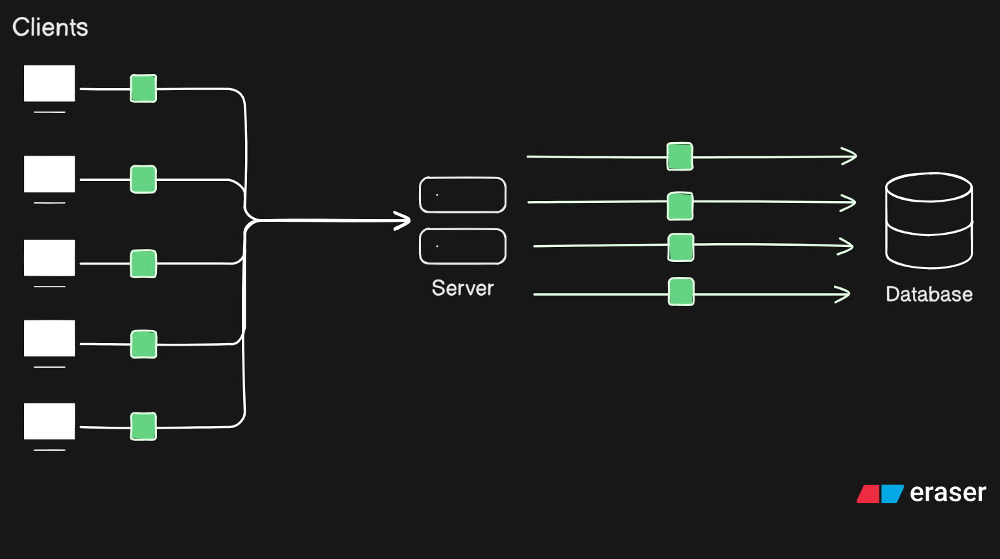

# Batch Processing
Processing large sets of jobs or data together or asynchronously, instead of handling each request immediately in real time.

## Features
- Batch processing for like/dislike operations
- Dead Letter Queue for failed jobs
- Configurable batch size and flush intervals

## Tech Stack
- ExpressJS & REST api
- MySQL (sequelize ORM)
- BullMQ (Message Queue + Worker For NodeJS)

## How It Works
→ Let's say we have a social media app, and suddenly a *celebrity* uploads a post. Within seconds, our server is receiving thousands of requests from users liking the post.

→ Without batch processing, each like requires an immediate database update. This means writing to the database thousands of times in a very short period, which can severely impact database performance and potentially take it down.

→ Using **batch processing**, we can significantly reduce the number of write requests to the database. Instead of writing to the database for each individual request, we **batch** them into a single job and make only one request to the database—a **bulk write in a single query**.

If a job fails, we re-enqueue it into the job queue with exponential backoff. A job can be re-enqueued only a limited number of times (retries). If it still fails to execute successfully, we push it into the **Dead Letter Queue** for manual debugging and processing. This ensures that data is not lost in case of uncertainty.